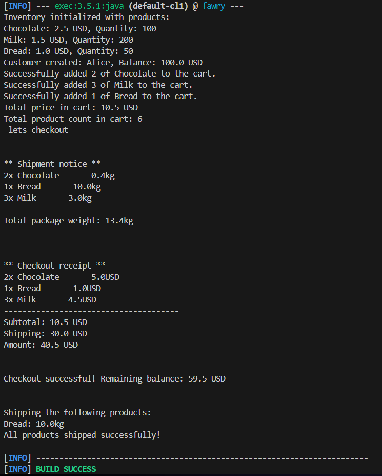

# Fawry Rise Journey — Inventory & Cart System

## Overview

This Java project simulates a simple **e-commerce system** including:

- Inventory management
- Customer carts
- Product expiration validation
- Shipping weight calculations
- Checkout process with balance deduction


---

## Features

- Add products to an inventory (with or without expiration dates)  
- Manage a customer's cart  
- Calculate total cart price and shipping cost  
- Print shipment notice and checkout receipt  
- Deduct total amount from customer balance after successful checkout

---

## Project Structure

```plaintext
src/main/java/com/fawry/
├── App.java        → Main application logic and test run
├── Product.java    → Product class with expiration and weight
├── Inventory.java  → Inventory management
├── Cart.java       → Cart management
├── Customer.java   → Customer data and wallet

```


---

## Sample Output



```plaintext
Sample Output

Inventory initialized with products:
Chocolate: 2.5 USD, Quantity: 100
Milk: 1.5 USD, Quantity: 200
Bread: 1.0 USD, Quantity: 50
Customer created: Alice, Balance: 100.0 USD
Successfully added 2 of Chocolate to the cart.
Successfully added 3 of Milk to the cart.
Successfully added 1 of Bread to the cart.
Total price in cart: 10.5 USD
Total product count in cart: 6
 lets checkout


** Shipment notice **
2x Chocolate       0.4kg
1x Bread       10.0kg
3x Milk       3.0kg

Total package weight: 13.4kg


** Checkout receipt **
2x Chocolate       5.0USD
1x Bread       1.0USD
3x Milk       4.5USD
--------------------------------------
Subtotal: 10.5 USD
Shipping: 30.0 USD
Amount: 40.5 USD


Checkout successful! Remaining balance: 59.5 USD


Shipping the following products:
Bread: 10.0kg
All products shipped successfully!

```

## Build & Run

Make sure you have **Maven** and **Java 17+** installed.
- Naviagate to \fawry\FawryRiseJourney> and run the following commands in Powershell.

```powershell
# Compile
mvn clean compile

# Run
mvn exec:java '-Dexec.mainClass=com.fawry.App'

